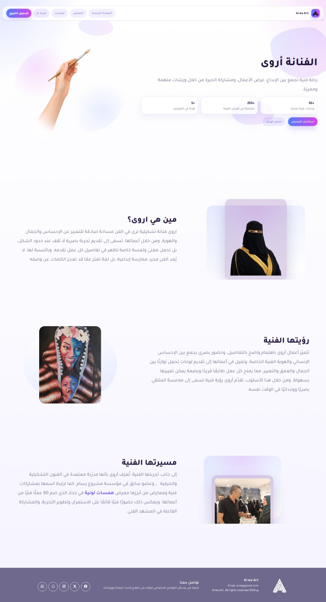
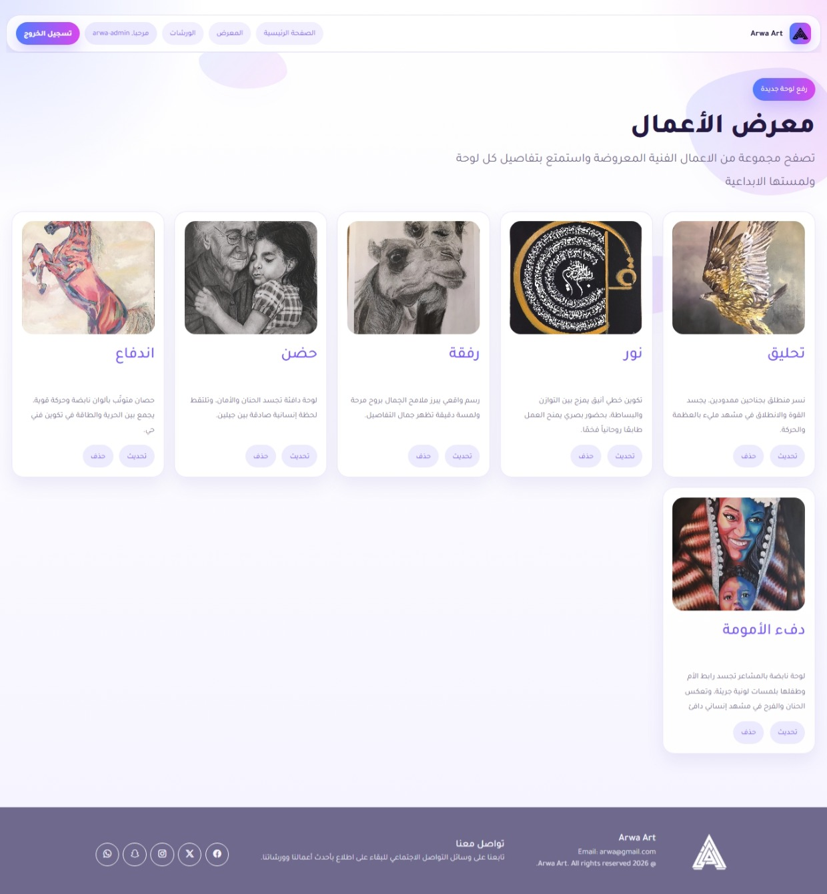
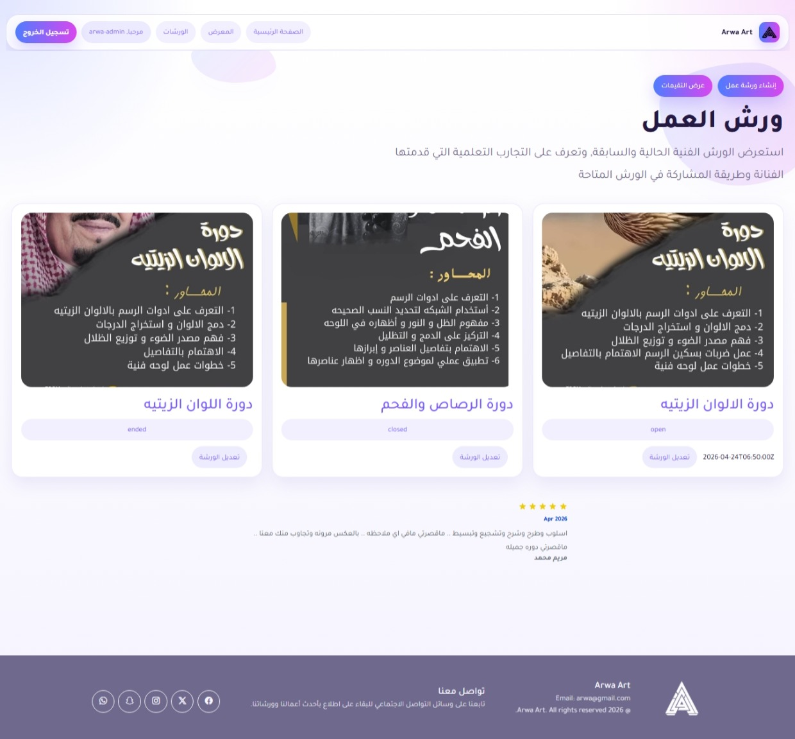
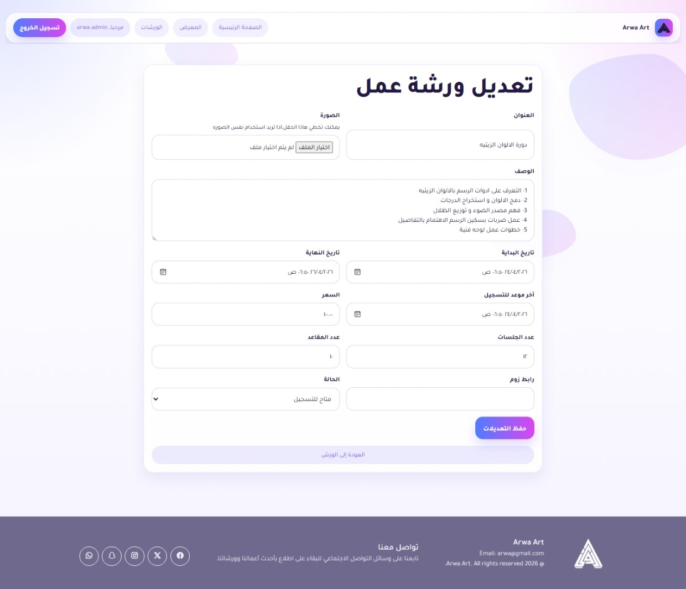

# Arwa Art

A Django-based web platform built for an artist to present her work in one dedicated place instead of being scattered across different social media platforms.

The main idea behind this project was to create a space that introduces the artist, tells her story, showcases her artwork, and makes it easier for people to interact with her work and join her workshops. I wanted the platform to feel useful, practical, and easy to manage on both sides: for visitors and for the artist herself.

---

## Live Website

The project is available online here:  
["https://arwa-art.onrender.com"]

> The deployed version is the best way to explore the full experience of the project.

---

## About the Project

This website was built around a real use case for an artist who shares her work and workshops online.

Instead of depending only on Instagram, Snapchat, TikTok, or other separate platforms, this project brings everything together into one organized website.

The platform introduces the artist, presents her journey, highlights the exhibitions she participated in, and displays her artwork in a more complete and professional way.

At the same time, the project also solves practical problems related to workshop registration, audience engagement, reviews, and communication with interested users.

---

## Main Features

### Artist Profile and Introduction

The website includes a section that introduces the artist, who she is, how her journey started, and the exhibitions and artistic work she has been involved in.

This gives visitors a clearer picture of the artist beyond short social media posts and helps create one central place where people can learn more about her.

### Gallery

The gallery section displays the artist’s paintings in one place.

Visitors can browse all artworks and open each painting individually to view its details.

I also added interaction features so the website would not feel static. Instead of only showing paintings, visitors can engage with them by:

- leaving comments
- liking artworks
- viewing likes and comments for each painting

This was important to me because I wanted the platform to feel more alive and interactive, not just a simple display page.

### Artist Dashboard

The artist has access to a dashboard where she can manage her content herself.

Through the dashboard, she can:

- add new paintings
- update existing paintings
- delete paintings
- manage workshop data
- change workshop status when needed

One thing I cared about while building this dashboard was simplicity. Since the platform is meant to be practical for real use, I wanted the dashboard to be clean, clear, and easy to navigate without unnecessary complexity.

### Workshops System

The platform includes a full workshop section where visitors can see available workshops created by the artist.

Each workshop includes its own timeline and deadline. If the registration deadline passes, the workshop is no longer treated as open for registration in the same way, since the course has already started or closed.

The artist can manage workshops directly from the dashboard by creating, updating, and changing their status whenever needed.

### User Accounts and Authentication

The platform includes a user system because registration is necessary for workshop enrollment and user interaction.

Users can:

- create an account
- activate their account through email verification
- sign in normally
- sign in with Google

For users who sign in through Google but still have incomplete profile information, the system redirects them to another page to complete the missing details.

I added email activation because I wanted to avoid fake or incomplete registrations and make sure the email belongs to the actual user.

### Workshop Registration and Payment Confirmation

Users can register for workshops through the website.

During registration, they can see the workshop requirements, conditions, and payment instructions.

The payment process here is based on bank transfer confirmation, not direct online checkout.
This was a practical decision based on the artist’s own preference. I originally wanted to explore adding a direct payment gateway as part of the challenge, but the artist preferred bank transfer for now, so I designed the registration flow around that.

After transferring the payment, the user submits the required confirmation, and the information is stored in the system.

The artist can then review the submitted registration and decide whether to accept or reject it.

Once the registration is reviewed, the system sends an email to the user with the result.

### Reviews System

The project also includes a reviews feature connected to workshop feedback.

The review data is collected through Google Forms, then fetched using the Google Sheets API and displayed inside the platform.

In addition to that, the artist can manage which reviews appear publicly by accepting or rejecting them.

This gives her control over what is shown while still keeping the review process organized and connected to the workshops.

### Email Notifications

The website supports email notifications for users who want to stay updated.

Users can choose whether they want to receive emails when:

- a new painting is added
- a new workshop is published

This feature was added to solve a real communication problem.

Before that, workshop announcements were being sent manually to many people through direct messages, including people who were not always interested. That took time and made communication less efficient.

With this system, only interested users receive updates, which makes the process more targeted and more useful for both the artist and the audience.

### Automatic Review Request After Workshop Completion

After a workshop ends, the artist can send the feedback form link to all registered users of that workshop.

I handled this on both the frontend and backend sides:

- on the frontend, the related button appears when the workshop reaches its completed state
- on the backend, the logic makes sure the feature is only available in the correct context

This makes collecting workshop reviews much easier and removes the need to contact participants manually one by one.

---

## Problems This Project Helps Solve

This project was not only about displaying paintings. I wanted it to solve real problems at the same time.

Some of the problems this project helps with:

- Scattered presence across different platforms  
  The artist’s work and updates were spread across multiple social media channels. This website creates one central place where visitors can learn about the artist, view her work, and follow her activities more clearly.

- Manual workshop communication  
  Workshop updates used to take time because announcements were sent manually to many people, including those who were not always interested. The notification and registration system makes this much more organized.

- No central place for workshop management  
  The platform gives the artist one place to manage workshops, registrations, reviews, and communication.

- Lack of interaction in a normal portfolio site  
  Instead of building a static website, I wanted to add interaction through likes, comments, reviews, registration, and notifications.

---

## Tech Stack

- Python
- Django
- Django REST Framework
- PostgreSQL / SQLite
- HTML
- CSS
- JavaScript
- Google OAuth
- Email authentication and verification
- Google Forms
- Google Sheets API

---

## Project Structure

This project was built using Django and structured into multiple apps to keep responsibilities separated and the codebase easier to manage.

Main parts of the project include:

- accounts → authentication, registration, login, profile-related logic
- gallery → paintings, painting details, comments, likes
- workshop → workshop management, registration, status updates, email flows
- reviews → review display and review-related logic
- art → main project settings and core configuration

---

## What I Focused On While Building It

While building this project, I tried to focus on more than just making features work.

I paid attention to:

- building a real use case instead of a demo-only project
- making the dashboard simple enough for real usage
- improving interaction between users and the platform
- handling registration and review workflows in a practical way
- using authentication only where it actually serves a purpose
- connecting external tools like Google login and Google Sheets where they add value

---

## Future Improvements

There are still several things I would like to improve in future versions of the project:

- adding direct online payment if that becomes needed later
- adding a dedicated section for paintings available for sale
- improving the reviews flow further
- polishing the public presentation of workshop feedback
- expanding the dashboard with more management and analytics features

---

## Screenshots

### Home Page

### Gallery

### Painting Details

### Workshops

### Dashboard

---

## Notes

Some features such as email delivery, Google login, and Google Sheets integration require external credentials and environment variables to work properly.

Because of that, the live deployed version is the best way to explore the full project experience.

---

## What This Project Represents for Me

This is my first major Django project built around a real-world use case.

More than just being a portfolio piece, it helped me practice building a system that includes authentication, external integrations, artist content management, workshop workflows, email communication, reviews, and user interaction in one project.

It also pushed me to think beyond simple CRUD functionality and focus more on how a real user would actually use the system.